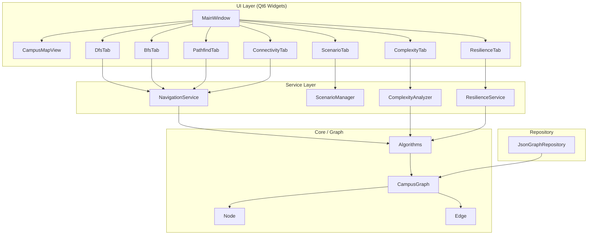

# EcoCampusNav

Sistema de navegación de campus universitario implementado en C++17 con Qt6. Modela el campus como un grafo ponderado y expone algoritmos DFS, BFS, búsqueda de caminos y análisis de resiliencia a través de una interfaz gráfica interactiva.

## Arquitectura



## Estructura de directorios

```
EcoCampusNav/
├── CMakeLists.txt
├── CMakePresets.json
├── campus.json          # Datos del grafo del campus
├── settings.json        # Configuración de la aplicación
├── src/
│   ├── main.cpp
│   ├── core/graph/      # Estructuras de datos y algoritmos
│   ├── repositories/    # Carga desde JSON
│   ├── services/        # Logica de negocio
│   └── ui/              # Widgets Qt6
```

## Requisitos

- CMake >= 3.20
- C++17 compatible compiler (GCC 10+, Clang 12+, MSVC 2019+)
- Qt6 >= 6.2 (Widgets module)
- Conexión a internet para descargar nlohmann/json (o proveer manualmente)

## Compilar y ejecutar

```bash
# Configurar (Release)
cmake --preset release

# Compilar
cmake --build build

# Ejecutar (desde el directorio build)
cd build
./EcoCampusNav
```

### Build manual sin presets

```bash
cd EcoCampusNav
cmake -B build -DCMAKE_BUILD_TYPE=Release
cmake --build build -j$(nproc)
cd build && ./EcoCampusNav
```

## Complejidad algorítmica

| Algoritmo       | Tiempo    | Espacio   | Estructura interna |
|-----------------|-----------|-----------|-------------------|
| DFS             | O(V + E)  | O(V)      | Stack (LIFO)      |
| BFS             | O(V + E)  | O(V)      | Queue (FIFO)      |
| Busqueda camino | O(V + E)  | O(V * P)  | DFS con path      |
| Conectividad    | O(V + E)  | O(V)      | BFS global        |

Donde V = vertices (nodos), E = aristas, P = longitud del camino.

## Funcionalidades

### Pestañas de la interfaz

| Pestaña       | Descripción |
|---------------|-------------|
| **DFS**       | Recorrido en profundidad desde nodo seleccionado, muestra orden de visita y distancias acumuladas |
| **BFS**       | Recorrido en anchura, garantiza orden por niveles |
| **Conectividad** | Verifica si el grafo es conexo; lista componentes conexas |
| **Camino**    | Busca ruta entre dos nodos con DFS; resalta en el mapa |
| **Escenarios** | Activa modo movilidad reducida (bloquea escaleras) o tipo de estudiante |
| **Complejidad** | Mide tiempos reales de DFS y BFS, muestra complejidad teórica O(V+E) |
| **Fallos**    | Simula bloqueos de aristas (construccion, emergencias) y busca rutas alternativas |

### Mapa interactivo

- **Zoom**: rueda del raton
- **Pan**: boton central del raton + arrastrar
- **Click en nodo**: muestra informacion en barra de estado
- **Tooltip**: pasar el cursor sobre un nodo muestra nombre, tipo y nivel z

## Formato campus.json

```json
{
  "nodes": [
    {"id": "ID_UNICO", "name": "Nombre legible", "type": "tipo", "x": 100, "y": 200, "z": 0}
  ],
  "edges": [
    {"from": "A", "to": "B", "base_weight": 5.0, "mobility_weight": 5.0, "blocked_for_mr": false}
  ]
}
```

### Tipos de nodo disponibles

| Tipo        | Color     | Descripción              |
|-------------|-----------|--------------------------|
| exterior    | Gris      | Espacios al aire libre   |
| comedor     | Naranja   | Zona de comidas          |
| biblioteca  | Azul      | Biblioteca universitaria |
| aulas_n1    | Verde     | Aulas nivel 1            |
| aulas_n2    | Verde agua| Aulas nivel 2            |
| escalera    | Rojo      | Escaleras (no-MR)        |
| elevador    | Purpura   | Elevadores (accesibles)  |
| transporte  | Amarillo  | Paradas de autobus       |

## Preguntas y respuestas de ejemplo

**P1: ¿Por que se usa DFS para búsqueda de caminos en lugar de Dijkstra?**
R: El proyecto demuestra algoritmos de recorrido de grafos (DFS/BFS) como objetivo educativo. DFS encuentra *un* camino válido en O(V+E). Dijkstra encontraría el camino *óptimo* pero con mayor complejidad de implementación. Para un campus pequeño (50 nodos), la diferencia práctica es mínima.

**P2: ¿Como maneja el sistema a un estudiante con movilidad reducida?**
R: Las aristas con `blocked_for_mr: true` (escaleras) son excluidas del grafo efectivo cuando `mobility_reduced = true`. El sistema usa `mobility_weight` en lugar de `base_weight` y el elevador queda como única vía vertical. Esto se activa en la pestaña Escenarios.

**P3: ¿Que ocurre si el grafo no es conexo?**
R: La pestaña Conectividad ejecuta BFS desde cada nodo no visitado para identificar todas las componentes conexas. Si hay más de una componente, ciertos destinos serán inalcanzables desde algunos orígenes y `PathResult::found` retornará `false`.

**P4: ¿Como se simula un bloqueo de ruta (construccion, emergencia)?**
R: En la pestaña Fallos se selecciona una arista y se presiona "Bloquear". Esto llama a `ResilienceService::blockEdge()` que marca `currently_blocked = true` en ambas direcciones del grafo. La búsqueda de ruta alternativa ignora estas aristas. "Desbloquear Todo" restablece el estado original. 

**P5: ¿Cuál es la diferencia entre base_weight y mobility_weight?**
R: `base_weight` es la distancia/costo para un estudiante sin restricciones. `mobility_weight` puede ser mayor (rampas más largas) o infinito efectivo (escaleras con `blocked_for_mr: true`, weight=0 indica bloqueo). Cuando el modo movilidad reducida está activo, `Algorithms::effectiveWeight()` usa `mobility_weight`.
